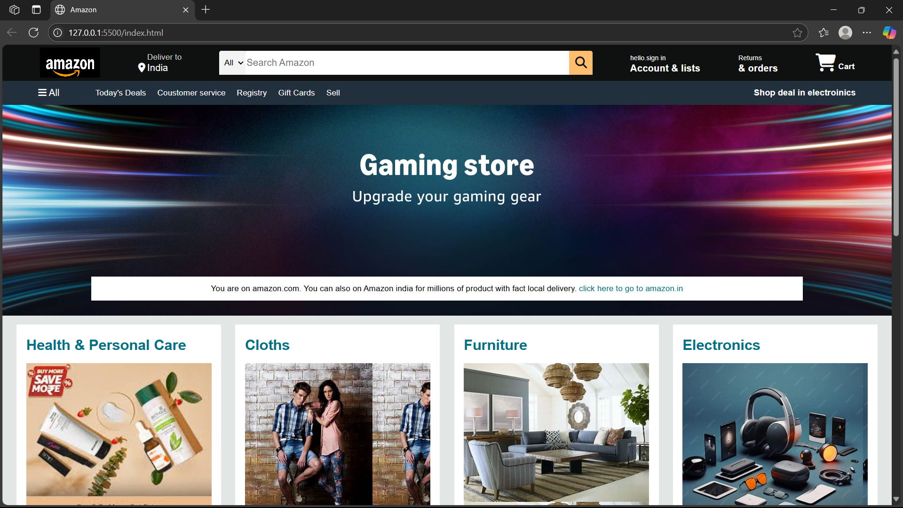
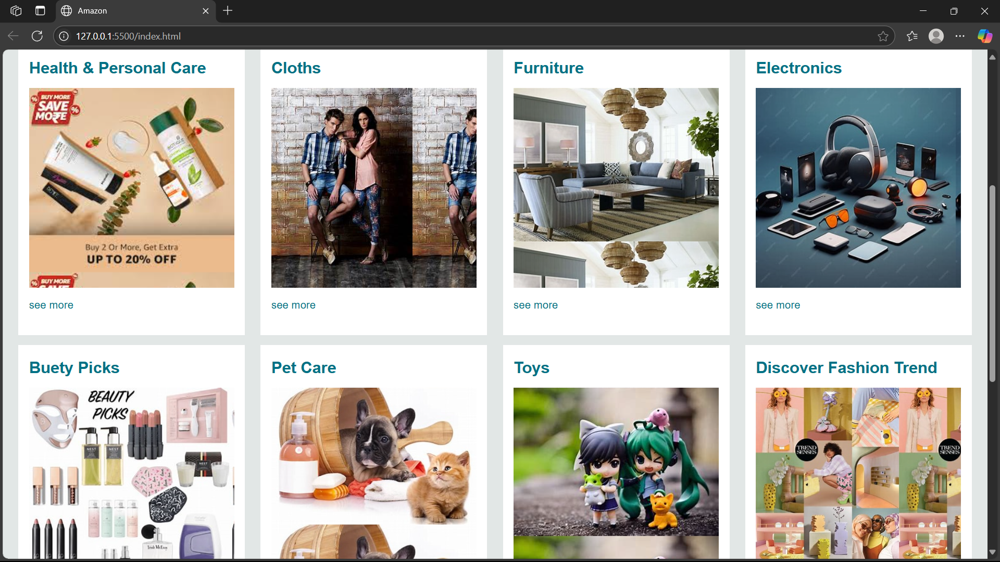
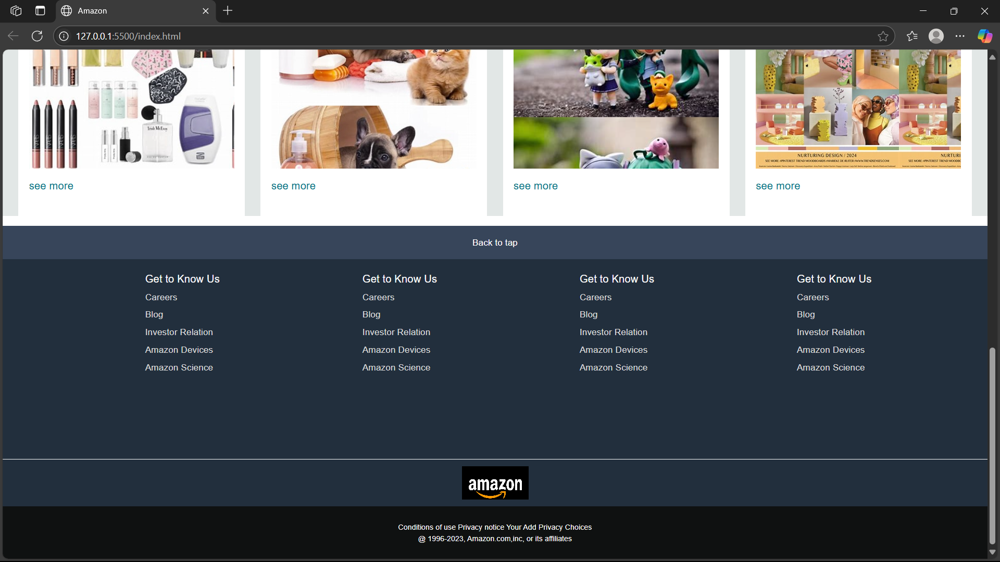

# amazon-frontend-clone
 Amazon homepage clone built using pure HTML and CSS. This project replicates the layout and design of Amazon's main page, including the navbar, search bar, product grid, and footer — all styled to closely match the original.

Screenshots :

